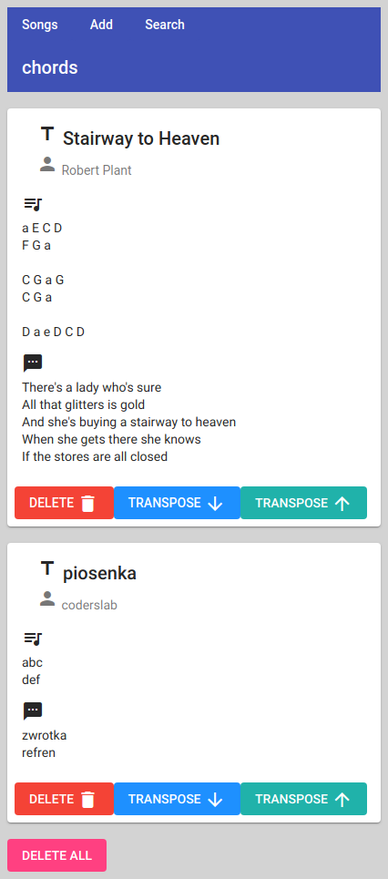

# Coderslab - praca końcowa
## Chords
Coderslab final assignment app.  
*Chords* - webapp designed to store guitar chords:  
  
  * Back-end - REST Server in Spring  
  * Front-end - PWA (Angular)

  
Angular Material Components used for styling.

Screenshot:  
  

## TO-DO
Upcoming changes in *Chords*
* Categories of songs
* DTO conversion
* Spring Security and user accounts
* Service workers
